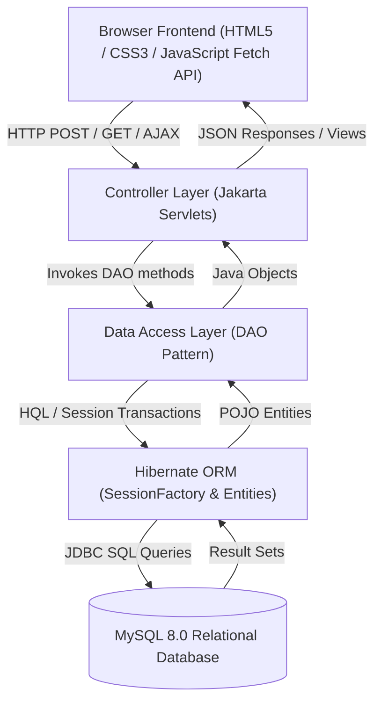

# 📚 Library Management System (SmartLib)

A full-stack, enterprise-grade **Library Management System** built with **Core Java**, **MySQL**, **Hibernate ORM**, **Jakarta Servlets**, **HTML5**, **CSS3**, and **JavaScript (Fetch/AJAX)**.

The project strictly follows the classic **MVC (Model-View-Controller)** architecture pattern.

---

## 🏛️ System Architecture (MVC)



- **Model Layer**: Hibernate 6.5 ORM entities (`User`, `Book`, `Transaction`) and DAOs (`UserDAO`, `BookDAO`, `TransactionDAO`) backed by MySQL 8.
- **View Layer**: Responsive HTML5, CSS3 with glassmorphic cards and modal dialogs, and vanilla ES6 JavaScript using the Fetch API for zero-reload operations.
- **Controller Layer**: Jakarta Servlets (`AuthServlet`, `BookServlet`, `TransactionServlet`, `UserServlet`, `DashboardServlet`) handling HTTP requests, session management, and routing.

---

## 🛠️ Tech Stack & Prerequisites

| Component | Technology | Version |
| :--- | :--- | :--- |
| **Language** | Core Java (JDK) | Java 21 / 23 |
| **ORM / Persistence** | Hibernate Core (JPA) | 6.5.2.Final |
| **Controller** | Jakarta Servlet API | 6.0.0 |
| **Web Server** | Apache Tomcat | 10.1.34 (bundled in `/tools`) |
| **Database** | MySQL Server | 8.0 (localhost:3306) |
| **Build Tool** | Apache Maven | 3.9.9 (bundled in `/tools`) |
| **JSON Serialization** | Google Gson | 2.10.1 |
| **Security** | SHA-256 Hashing | Java Cryptography Architecture |
| **Frontend** | HTML5, Modern CSS, ES6 JS | Fetch API &amp; AJAX |

---

## 📋 Implementation Steps Breakdown

### Step 1: Database Schema (`database/schema.sql`)
- **`users` Table**: `id`, `username`, `password`, `full_name`, `email`, `phone`, `role` (`ADMIN` or `STUDENT`), `created_at`.
- **`books` Table**: `id`, `title`, `author`, `isbn`, `category`, `publisher`, `publication_year`, `quantity`, `available_copies`, `created_at`.
- **`transactions` Table**: `id`, `user_id` (FK), `book_id` (FK), `issue_date`, `due_date`, `return_date`, `fine_amount`, `status` (`ISSUED`, `RETURNED`, `OVERDUE`), `remarks`.

### Step 2: Development Environment Setup
- Bundled portable Maven 3.9.9 in `tools/apache-maven-3.9.9`.
- Bundled Apache Tomcat 10.1.34 in `tools/apache-tomcat-10.1.34`.
- Standard Maven Dynamic Web Project archetype producing `target/library.war`.

### Step 3: Hibernate Configuration (The Model Layer)
- `src/main/resources/hibernate.cfg.xml`: Configures MySQL JDBC URL (`jdbc:mysql://localhost:3306/library_db`), MySQLDialect, connection pool, and entity mappings.
- **POJOs / Entities**:
  - `User.java`: Mapped to `users` table with `@Entity`, `@Table`, `@Id`, `@GeneratedValue`.
  - `Book.java`: Mapped to `books` table with inventory and copy counters.
  - `Transaction.java`: Mapped to `transactions` table with `@ManyToOne` associations to `User` and `Book`.
- `HibernateUtil.java`: Thread-safe, singleton `SessionFactory` initializer.

### Step 4: Data Access Objects (DAO Layer)
- `UserDAO.java`: CRUD operations, username lookups, student member listings, and counts.
- `BookDAO.java`: CRUD, ISBN checks, multi-field search (title, author, ISBN, category), and stock counts.
- `TransactionDAO.java`:
  - **Issue Book**: Checks `availableCopies > 0`, decrements stock by 1, sets issue date and due date, records transaction.
  - **Return Book**: Computes overdue fine ($2.00/day if past due), updates return date, sets status to `RETURNED`, increments `availableCopies` by 1.
  - **History & Overdue**: Filters active, overdue, and past rentals.

### Step 5: Controller Layer (Java Servlets)
- `AuthServlet.java` (`/api/auth/*`): Login, registration, session management (`request.getSession()`), and logout.
- `BookServlet.java` (`/api/books/*`): Catalog search, category filters, and admin CRUD (add/edit/delete).
- `TransactionServlet.java` (`/api/transactions/*`): Issue book, student self-borrow, book return, and rental auditing.
- `UserServlet.java` (`/api/users/*`): Admin member directory and member removal.
- `DashboardServlet.java` (`/api/dashboard/stats`): Aggregates real-time KPIs (titles, stock, active loans, overdue alerts, fines).
- `AuthFilter.java`: Route protection securing dashboard views and handling unauthorized redirects.

### Step 6: Frontend Layer (HTML, CSS, JavaScript)
- `index.html`: Modern landing page introducing system features.
- `login.html`: Authentication page with 1-click test credential fill.
- `register.html`: Member registration with client-side form validation.
- `admin-dashboard.html`:
  - Live KPI stats cards (Total Titles, Inventory Copies, Available Stock, Active Checkouts, Overdue Alerts, Registered Members).
  - Tabs: **Manage Books**, **Active Checkouts & Returns**, **Transaction Audit Log**, **Library Members**.
  - Interactive modals: Add Book, Edit Book, Issue Book, and Return Book (with automated fine computing).
- `student-dashboard.html`:
  - Student profile and statistics (Currently Borrowed, Overdue Alerts, Books Read, Fines).
  - Tabs: **Browse Catalog** (live instant search & category filter), **My Borrowed Books** (countdown & return), **Reading History**.
- `css/style.css`: Clean responsive design system with status pills (`ISSUED`, `RETURNED`, `OVERDUE`), modern cards, and tables.
- `js/app.js`: Client-side Fetch API asynchronous controller with debounce search, modal management, and toast notifications.

---

## 🔑 Default Credentials

The database comes pre-seeded with sample accounts:

| Role | Username | Password | Full Name | Access Level |
| :--- | :--- | :--- | :--- | :--- |
| **Admin** | `admin` | `admin123` | Library Administrator | Full Admin Console (Inventory, Checkouts, Members) |
| **Student** | `student` | `student123` | John Doe | Student Portal (Browse, Borrow, Return, History) |
| **Student** | `sarah` | `student123` | Sarah Jenkins | Student Portal |

---

## 🚀 How to Run the Application

### Option A: 1-Click Launch (Recommended)
Simply double-click or run the included batch script:
```powershell
.\run.bat
```
This automatically compiles the project via Maven, deploys `library.war` to the bundled Apache Tomcat, starts the server, and opens your default browser at:
👉 **`http://localhost:8080/library/`**

To stop the server:
```powershell
.\stop.bat
```

---

### Option B: Running in Eclipse IDE
1. Open Eclipse and choose **File > Import > Existing Maven Projects**.
2. Select `c:\Users\MS\Downloads\library project`.
3. In the **Servers** tab, click **New > Server > Apache > Tomcat v10.1 Server**.
4. Point Tomcat installation directory to `tools\apache-tomcat-10.1.34`.
5. Right-click the project > **Run As > Run on Server**.

---

### Option C: Running in IntelliJ IDEA Ultimate
1. Open the project folder `library project` in IntelliJ.
2. Go to **Run > Edit Configurations > Add New Configuration (+)**.
3. Select **Tomcat Server > Local**.
4. Set Application Server to `tools\apache-tomcat-10.1.34`.
5. In the **Deployment** tab, click `+` > **Artifact** > select `library-management-system:war`.
6. Set Application Context to `/library` and click **Run**.

---

## 📡 REST / JSON API Endpoints Reference

| Method | Endpoint | Description | Role Required |
| :--- | :--- | :--- | :--- |
| `POST` | `/api/auth/login` | Authenticate user &amp; create session | Public |
| `POST` | `/api/auth/register` | Register new student account | Public |
| `POST` | `/api/auth/logout` | Invalidate current session | Logged in |
| `GET` | `/api/auth/current` | Returns logged-in user profile | Logged in |
| `GET` | `/api/books?action=list` | Search books by `search` and `category` | Public |
| `POST` | `/api/books` (action=add) | Add new book to catalog | Admin |
| `POST` | `/api/books` (action=update) | Update book details and inventory | Admin |
| `POST` | `/api/books` (action=delete) | Remove book from catalog | Admin |
| `GET` | `/api/transactions` | Fetch rentals (all for admin, own for student) | Logged in |
| `POST` | `/api/transactions` (action=issue) | Issue book to member (decrements stock) | Admin |
| `POST` | `/api/transactions` (action=borrow) | Self-service student checkout | Student |
| `POST` | `/api/transactions` (action=return) | Process return (restores stock &amp; calculates fine) | Member / Admin |
| `GET` | `/api/dashboard/stats` | Live system KPI statistics | Logged in |
| `GET` | `/api/users` | List registered members | Admin |
| `POST` | `/api/users` (action=delete) | Remove student member | Admin |

---

## ✅ Verified Workflow Tests

The integration test suite verified the following flows end-to-end against the live server:
1. **Authentication**: Admin and Student logins with session validation.
2. **Catalog Creation**: Adding a new book via Hibernate persist and verifying immediate availability in search.
3. **Atomic Stock Management**:
   - Available copies decremented from `5` to `4` when issued.
   - Available copies restored from `4` to `5` when returned.
4. **Fine Calculation**: Automated computation of `$2.00/day` on overdue checkouts with waiver support.
